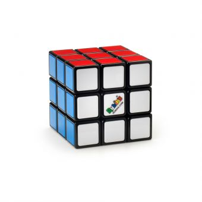
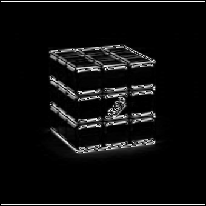
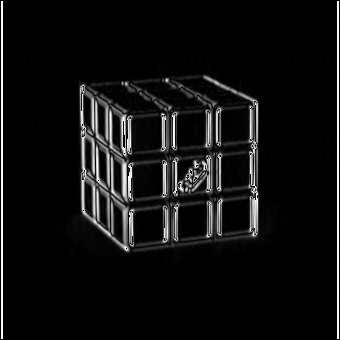
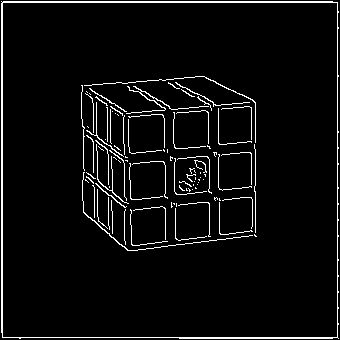
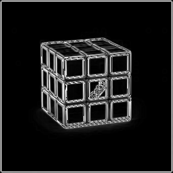
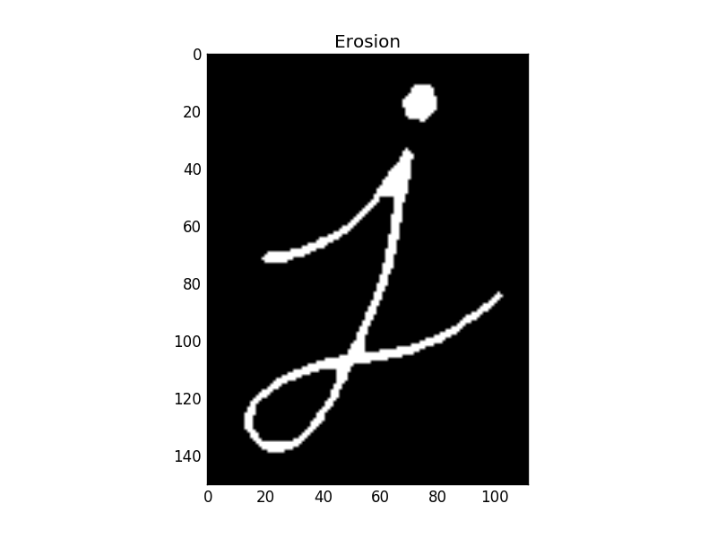
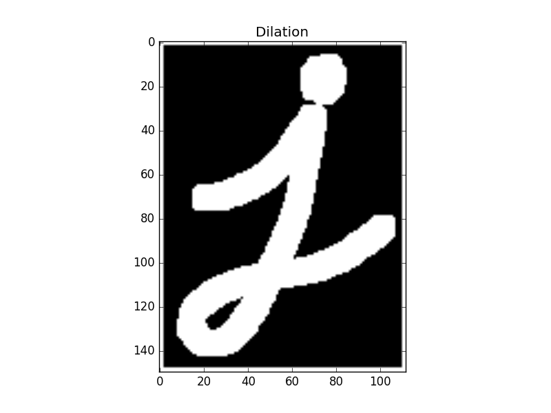
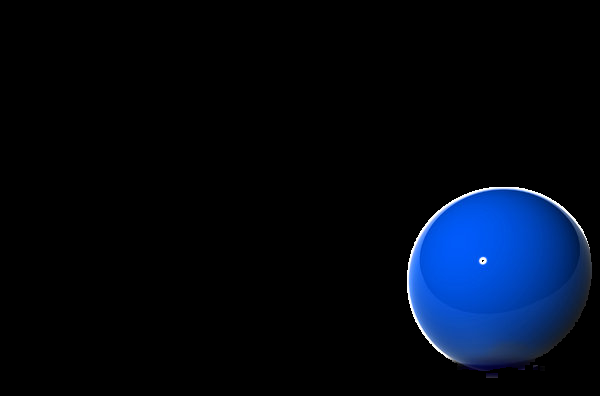

# About Image Processing Using Python
This is the repository for tasks given by SRA VJTI. The following tasks are done for Digital Image processing without using any inbuilt functions of Open CV except of some. The tasks are Guided by Seniors of SRA-VJTI.

# Table of Content
* [Image Rotation](Image_Rotation)

* [Applying Kernels](Kernels)
  * [ Blurring (With 3 Filters)](Kernels)
  * [Sharpening](Kernels)
* [Edge Detection (4 Types of Edge Detection)](Edge_detection )
* [Morphological Transformation](morphological_tranformation)
  * [Erosion](morphological_tranformation)
  * [Dilation](morphological_tranformation)
* [Masking](Masking)
* [Region Of Interest (ROI)](ROI)

# Task 1
## <em> Image Rotation </em>
> This task is about rotating the Given Input Image in Any Desired angle using libraries like PIL, numpy and matplotlib
> Rotation of an Image is one of the Image transform operations that can be applied on an Image. By Image rotation, the image is rotated about its center by specified number > of degrees. Image rotation is a specialization of affine transformation

> Where, θ is the angle of rotation.

Original image                     |  Rotated Image by Desired Angle
:-------------------------:|:-------------------------:
|

# Task 2
## <em> Applying Kernels </em>
## <em> Blurring (With 3 Filters) </em>

> Convolution in Image Processing 
> The term in Image processing Convolution is a misnomer to the term Cross – correlation. The process Is, consider a 6x6 matrix and the Kernel of 3x3 matrix. The resultant matrix will be of (6-3+1 = 4) i. e 4x4 matrix. The Kernel is placed on the Left Top most of the Image and the corresponding algorithms are used.

 Original image  
:-------------------------: 

 Box Blur             |                Weighted Average Blur             |          Gaussian Blur 
:-------------------------: |:-------------------------:|:-------------------------: 
||
## <em> Sharpening </em>

Original image                     |  Sharpened Image
:-------------------------:|:-------------------------:
|

 
 
# Task 3
## <em> Edge Detection (4 Types of Edge Detection)</em>

|                Horizontal Edge Detecion             | 
|:-------------------------:|

> orizontal edges produce a vertical gradient in the image, and can be enhanced with a vertical gradient detector. A vertical gradient filter can be defined by
<em> B ( j , k  ) = A (j + 1, k ) – A (j – 1 , k) </em>

|              Vertical Edge Detecion             | 
|:-------------------------:|

> Vertical edges can be detected by using a horizontal gradient operator followed by a threshold operation to detect the extreme values of the gradient. The gradient produces > a doublet of extremes, positive-negative or negative-positive, depending on the direction of the transition.

 |                Canny Edge Detecion             | 
|:-------------------------:|

> The Canny edge detector is an edge detectionoperator that uses a multi-stage algorithm to detecta wide range of edges in images. It was developed by John F. Canny in 1986. > Canny also produced a computational theory of edge detection explaining why the technique works.

|                Sobel Edge Detecion             | 
|:-------------------------:|

> The Sobel filter is used for edge detection. It works by calculating the gradient of image intensity at each pixel within the image. It finds the direction of the largest . > increase from light to dark and the rate of change in that direction. The result shows how abruptly or smoothly the image changes at each pixel, and therefore how likely it > is that that pixel represents an edge.

 |                Original Image             | 
|:-------------------------:|

Horizontal Edge                    |  Vertical Edge           |   Canny Edge Detection         |     Sobbel Edge detection
:-------------------------:|:-------------------------:|:-------------------------:|:-------------------------:
|||

# Task 4
## <em>Morphological Transformation </em>
## <em> Erosion </em>

> Erosion is the process in the Image Processing in which the size of the Image is decreased by the process of Convolution
## <em> Dilation </em>

> Dilation is the process in the Image Processing in which the size of the Image is increased by the process of Convolution
 Original Image             |                Eroted Image             |          Dilated Image
:-------------------------: |:-------------------------:|:-------------------------: 
||
## Task 5
## <em> Masking</em>

> Masking is the process in which the Desired coloured image is identified in the given Image 

Original image                     |  Detected Image of the Required Colour(Blue)
:-------------------------:|:-------------------------:
|

 

# Task 6
## <em>Region Of Interest (ROI) </em>

> ROI(Region of Interest) in Image Processing is the process by we can seperate the desired image

Original image                     |      Desired Output
:-------------------------:|:-------------------------:
|

