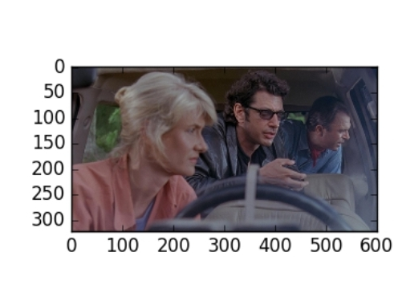
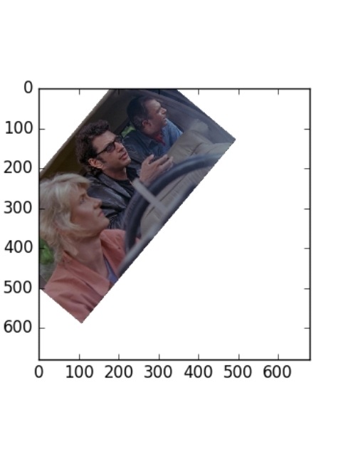
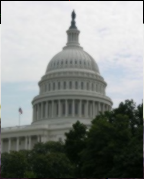
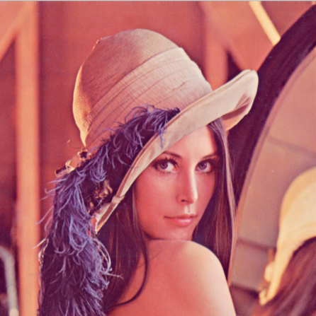
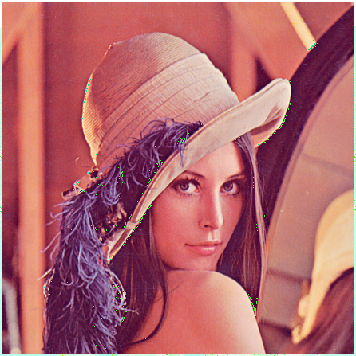

# About Image Processing Using Python
This is the repository for tasks given by SRA VJTI. The following tasks are done for Digital Image processing without using any inbuilt functions of Open CV except of some. The tasks are Guided by Seniors of SRA-VJTI.

# Table of Content
* [Image Rotation](Image_Rotation)

* [Applying Kernels](Kernels)
  * [ Blurring (With 3 Filters)](Kernels)
  * [Sharpening](Kernels)
* [Edge Detection (4 Types of Edge Detection)](Edge_Detection )
* [Morphological Transformation](morphological_tranformation)
  * [Erosion](morphological_tranformation)
  * [Dilation](morphological_tranformation)
* [Masking](Masking)
* [Region Of Interest (ROI)](ROI)

## Task 1
### <em> Image Rotation </em>
> This task is about rotating the Given Input Image in Any Desired angle using libraries like PIL, numpy and matplotlib

Original image                     |  Rotated Image by Desired Angle
:-------------------------:|:-------------------------:
|

## Task 2
### <em> Applying Kernels </em>
### <em> Blurring (With 3 Filters) </em>
 Original image  
:-------------------------: 

 Box Blur             |                Weighted Average Blur             |          Gaussian Blur 
:-------------------------: |:-------------------------:|:-------------------------: 
||
### <em> Sharpening </em>

Original image                     |  Sharpened Image
:-------------------------:|:-------------------------:
|

 
 
## Task 3
### <em> Edge Detection (4 Types of Edge Detection)</em>
## Task 4
### <em>Morphological Transformation </em>
### <em> Erosion </em>
### <em> Dilation </em>
## Task 5
### <em> Masking</em>
## Task 6
### <em>Region Of Interest (ROI) </em>
